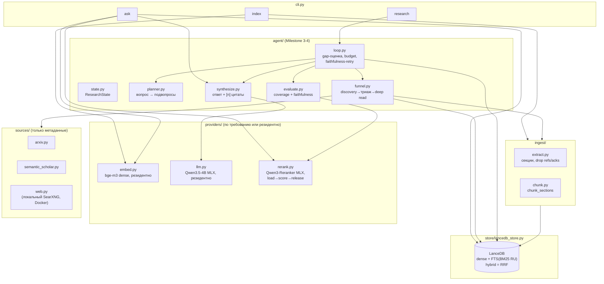

# local-research-agent

Локальный агент научных исследований и трендов (MacBook M4 Air, 16 ГБ, всё
локально). Полный план и жёсткие ограничения — в
[DEVELOPMENT_PLAN.md](DEVELOPMENT_PLAN.md) и [CLAUDE.md](CLAUDE.md). Все 4
милестона плана реализованы и подтверждены реальными прогонами (не только
тестами на моках) — детали и найденные по ходу баги в
`DEVELOPMENT_PLAN.md`.

## Быстрый старт

```bash
uv venv
uv pip install -r requirements.txt
python -m src.cli index
python -m src.cli ask "Что такое RAG?"

docker compose up -d   # опционально: локальный веб-поиск для research (см. ниже)
python -m src.cli research "Какие подходы применяются для сжатия KV-cache в трансформерах?"

uv run pytest -q
```

## Архитектура



Ключевой инвариант памяти (§1 плана): `embed`/`llm` резидентны, `rerank`
грузится и освобождается на каждый вызов — никогда две тяжёлые модели не
держатся резидентно одновременно рядом с реранкером.

## Milestone 0 — тупой сквозной путь

Single-pass RAG без цикла и воронки: `index` строит эмбеддинг-индекс из
`corpus/` в LanceDB, `ask` находит top-k чанков и просит локальную LLM
(Qwen через MLX) ответить с цитатами `[n]`.

## Milestone 1 — hybrid retrieval + чистое извлечение

- `ingest/extract.py` — секция-осознанное извлечение (markdown/HTML/PDF),
  отбрасывает References/Bibliography/Acknowledgments/Appendix.
- `ingest/chunk.py` — `chunk_sections` режет чанки по границам секций.
- `store/lancedb_store.py` — гибридный поиск (`search_hybrid`): dense-вектор
  + LanceDB FTS (BM25, `language="Russian"`), слияние через RRF. `search_dense`
  оставлен как baseline для сравнения.
- `ask` теперь использует `search_hybrid` по умолчанию.

### Установка

```bash
uv venv
uv pip install -r requirements.txt
```

### Запуск

```bash
python -m src.cli index
python -m src.cli ask "Что такое RAG?"
```

`index` читает `.txt`/`.md`/`.html`/`.pdf` из `corpus/` (в репозитории лежит
маленький тестовый корпус: 3 заметки про RAG/векторные БД/локальные LLM + одна
статья-образец с Abstract/Introduction/Method/Results/Conclusion/References/
Acknowledgments — проверить отброс References/Acknowledgments).

### Тесты

```bash
uv run pytest -q
```

Тесты офлайн: эмбеддинги и LLM мокаются, реальная загрузка Qwen3.5/bge-m3 не
требуется для прогона тестов.

### Eval retrieval@k (dense vs hybrid)

Не pytest — гоняет реальные bge-m3-эмбеддинги, требует уже построенного
индекса:

```bash
python -m src.cli index
python -m scripts.eval_retrieval
```

Последний прогон (2026-08-05, 8 эталонных пар, k=3): dense 8/8, hybrid 8/8 —
hybrid не хуже dense. Корпус пока мал, чтобы разница в recall проявилась, но
ранжирование внутри top-k реально разное (проверено вручную на лексическом
запросе про формулу RRF).

## Milestone 2 — реранкер по требованию

`providers/rerank.py` — `mlx-community/Qwen3-Reranker-0.6B-4bit` (чистый MLX,
331MB): `cmd_ask` берёт `RERANK_CANDIDATES_K` кандидатов из hybrid-поиска,
реранкер грузится, скорит, освобождается, отдаёт top-`TOP_K_RETRIEVE`.
Отключается флагом `config.RERANK_ENABLED = False`.

Изначально планировался `BAAI/bge-reranker-v2-m3` (FlagEmbedding/torch), но он
конфликтует по версии `transformers` с `mlx_lm` (LLM-провайдер) — подробности
в `DEVELOPMENT_PLAN.md`.

```bash
python -m src.cli index
python -m scripts.eval_rerank
```

Последний прогон (2026-08-05): hit@1 hybrid 8/8, +rerank 8/8 — на этом
корпусе реранк не деградирует hybrid. Замер памяти (`mlx.core`):
`active_memory`/`cache_memory` 0 → 335MB/360MB во время скоринга → 0/0 после
`_release()` — модель реально не резидентна между вызовами.

## Milestone 3 — воронка + итеративный цикл + состояние

`python -m src.cli research "вопрос"` — deep-research режим поверх внешних
источников (в отличие от `ask`, который ищет только по уже построенному
локальному индексу):

- `agent/state.py` — `ResearchState` (подвопросы, кандидаты, `read_ids`,
  findings, бюджет).
- `sources/arxiv.py`, `sources/semantic_scholar.py`, `sources/web.py` —
  discovery по метаданным, все три реально работают без ключа (web — через
  локальный SearXNG, см. раздел ниже).
- `agent/planner.py` — вопрос → подвопросы (детерминированная эвристика, без
  LLM — план явно требует держать планирование в коде).
- `agent/funnel.py` — discovery → эмбеддинг-триаж → deep read (PDF для
  arXiv, abstract-fallback для источников без full-text). Подвопросы на
  русском переводятся в английский поисковый запрос bounded LLM-вызовом
  перед discovery — иначе arXiv/Semantic Scholar дают 0 совпадений.
- `agent/loop.py` — итеративный контроллер: gap-оценка = порог score
  реранкера (`>= 0.5`) И покрытие ≥2 разных источников; с каждым проходом
  discovery запрашивает больше кандидатов.

```bash
python -m src.cli research "Какие подходы применяются для сжатия KV-cache в трансформерах?"
```

Реальные прогоны (2026-08-05, подробности и три найденных бага — в
`DEVELOPMENT_PLAN.md`): >1 итерации с новыми (не предзагруженными) статьями
подтверждено; кэш-хит на повторном вопросе подтверждён (`iterations=1`, 0
новых `read_ids`, 0 внешних запросов); завершение по `budget` с честным
отражением gaps в ответе подтверждено.

## Milestone 4 — оценка + упаковка

`agent/evaluate.py` — самопроверка сгенерированного ответа:

- **Citation coverage** — доля предложений-утверждений с хотя бы одной `[n]`.
- **Faithfulness** — доля процитированных утверждений, реально подтверждённых
  текстом источника (проверяется через `providers/rerank.score_pairs` —
  переиспользуем уже готовый калиброванный реранкер вместо отдельной
  NLI-модели или ещё одного LLM-вызова).

`agent/loop.py` интегрирует это: когда все подвопросы покрыты, черновой
синтез прогоняется через `evaluate()` — при низкой faithfulness подвопросы
переоткрываются на один дополнительный проход в пределах `budget`.

```bash
python -m src.cli index
python -m scripts.eval_faithfulness
```

Последний прогон (2026-08-05, 8 эталонных вопросов): среднее citation
coverage 0.59, среднее faithfulness 0.75. Два кейса, где eval поймал
неподтверждённое утверждение — контролируемый (юнит-тест с намеренно
выдуманным фактом) и реальный (модель честно написала мета-утверждение об
отсутствии данных, сославшись сразу на диапазон `[1]–[5]` — eval пометил это
unsupported, т.к. реранкер плохо валидирует отрицания против одного
источника; подробности и попытки спровоцировать настоящую выдумку числа — в
`DEVELOPMENT_PLAN.md`).

## Общий веб-поиск (локальный SearXNG)

`sources/web.py` ищет по обычным сайтам (не только научным статьям) через
свой локальный инстанс [SearXNG](https://docs.searxng.org/) в Docker —
без API-ключа и без лимитов запросов:

```bash
docker compose up -d          # поднять (один раз, держится в фоне)
docker compose down           # остановить
```

Проверить, что реально работает:

```bash
curl "http://localhost:8888/search?q=test&format=json"
```

Публичные бесплатные варианты (DuckDuckGo HTML, публичные SearXNG-инстансы)
на практике не годятся — проверено вручную, подробности в
`DEVELOPMENT_PLAN.md` (пост-M4 раздел): DuckDuckGo блокирует запросы
CAPTCHA-челленджем, публичные SearXNG либо `429`, либо JSON API выключен.
Без поднятого `docker compose up -d` `WebSource.discover()` просто
возвращает пустой список (не роняет `research` — воронка продолжает с
arXiv/Semantic Scholar).

## Известные допущения (`ARCH-Q`)

Непроверенные на реальном железе допущения помечены `# ARCH-Q:` прямо в коде
(`src/config.py`, `src/providers/embed.py`, `src/providers/llm.py`) —
HF-репо/тег LLM, kwarg устройства FlagEmbedding, поддержка
`enable_thinking` в chat-template. Проверить и зафиксировать при первом
реальном запуске на M4 Air, включая пик памяти (см. критерий готовности в
`DEVELOPMENT_PLAN.md`).
