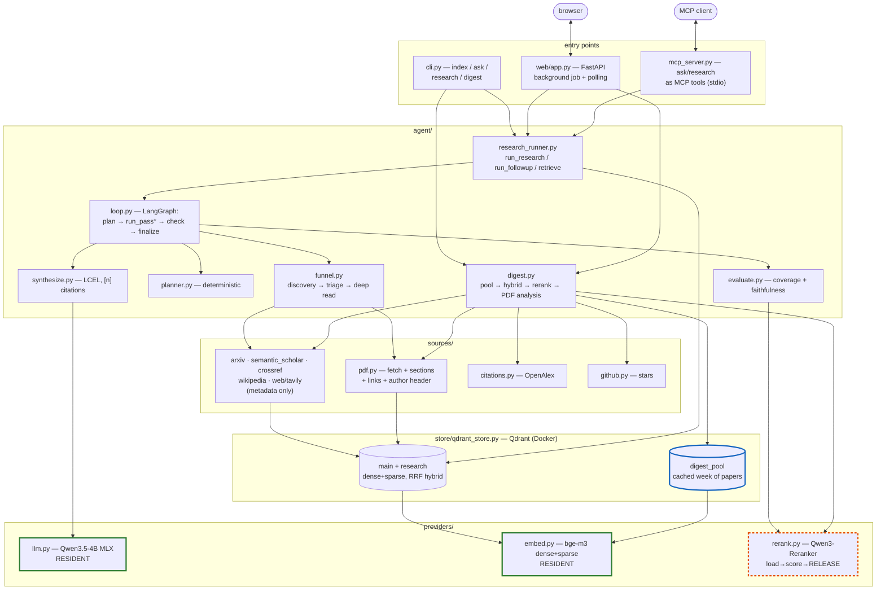

# local-research-agent

A local deep-research agent that runs entirely on-device (MacBook M4 Air,
16GB, MLX). It searches arXiv, Semantic Scholar, CrossRef, Wikipedia and the
general web, reads and cites what it finds, and self-checks its answers
before returning them. It also tracks fresh AI papers (`digest`), speaks MCP
in both directions, and ships a web UI.

Standing engineering rules (memory constraints, provider seams, test policy)
live in [CLAUDE.md](CLAUDE.md). Design rationale lives in module docstrings —
this file is the tour.

## Quickstart

```bash
uv venv
uv pip install -r requirements.txt
docker compose up -d qdrant                  # required

python -m src.cli index                       # build index from corpus/
python -m src.cli ask "What is RAG?"          # local RAG, no internet
python -m src.cli research "KV-cache compression approaches?"   # full pipeline
python -m src.cli digest --query "diffusion models"             # fresh arXiv papers
python -m src.cli serve                       # web UI at http://127.0.0.1:8000
python -m src.cli mcp-serve                   # expose ask/research over MCP

uv run pytest -q
```

Optional: `cp .env.example .env` and add `TAVILY_API_KEY` for broader web
search; otherwise `docker compose up -d searxng` gives a local fallback.

## The three modes

| | question | what it does | sources |
|---|---|---|---|
| `ask` | required | retrieval over the local index only | `corpus/` |
| `research` | required | iterative discovery → deep read → cited answer | arXiv, S2, CrossRef, Wikipedia, web |
| `digest` | optional | what's new in AI, ranked by topic if given | arXiv only |

## Architecture



Green = resident for the process lifetime · dashed orange = loaded and
released per call · blue = cache that survives between runs.

**The memory invariant** (§1 CLAUDE.md): `llm` and `embed` stay resident;
`rerank` loads → scores → releases on every call. Two heavy models are never
resident at once. LangChain wrappers (`langchain_llm.py`,
`langchain_embeddings.py`) are thin interfaces over those same instances, not
second copies.

**The honesty invariant**: when a fact isn't available, the agent says so
instead of guessing. Missing OpenAlex record → "не проиндексировано", not
`0` citations. No affiliation in the PDF → a dash, not a plausible
university. GitHub API rate-limited → no star count, not `0` stars.

## `index` / `ask` — local RAG

```bash
python -m src.cli index                  # .txt/.md/.html/.pdf from corpus/
python -m src.cli index --mcp-dir ~/notes   # + any dir via MCP filesystem server
python -m src.cli ask "What is RAG?"
```

- `ingest/extract.py` — section-aware extraction; drops References/
  Acknowledgments/Appendix. `ingest/chunk.py` chunks along section
  boundaries so a chunk never straddles two sections.
- `store/qdrant_store.py` — hybrid search: dense + sparse (bge-m3's own
  lexical weights, same forward pass), merged by Qdrant's RRF fusion. Also
  implements LangChain's `VectorStore`, so `retrieve()` goes through
  `.as_retriever()`.
- `providers/rerank.py` — takes `RERANK_CANDIDATES_K` hits, returns
  `TOP_K_RETRIEVE`. Off via `config.RERANK_ENABLED`.

## `research` — deep research

```bash
python -m src.cli research "What approaches exist for KV-cache compression?"
```

Unlike `ask`, this goes out and finds new material:

- **Planner** — question → subquestions in deterministic code, not an LLM
  call (a 4B model is an unreliable multi-step planner).
- **Funnel** (`agent/funnel.py`) — discovery → embedding triage → deep read.
  Only survivors get their full text fetched and indexed. Non-English
  subquestions are translated to a short English query first (arXiv and S2
  return nothing for Russian).
- **Loop** (`agent/loop.py`) — a LangGraph `StateGraph`: `plan` →
  `run_pass`* → `check_faithfulness` → `finalize`. A subquestion is covered
  when retrieval clears `FUNNEL_MIN_RERANK_SCORE` across
  `FUNNEL_MIN_SOURCES_TO_COVER` distinct sources.
- **Self-evaluation** (`agent/evaluate.py`) — citation coverage plus
  faithfulness (each cited claim scored against its source text by the
  existing reranker, not a separate NLI model). Low faithfulness reopens
  subquestions for one more forced-discovery pass within budget.

**Triage score** = semantic similarity + a log-scaled citation boost
(`CITATION_BOOST_SCALE`) + an exponentially-decaying recency boost
(`RECENCY_BOOST_SCALE`, `RECENCY_HALF_LIFE_DAYS`). The two boosts are summed,
not traded off: a brand-new paper structurally can't have citations yet, so
citation boost alone would bury exactly what "what's new" needs.

**Follow-ups.** After the first answer the conversation continues on the same
`ResearchState` — the CLI drops into a prompt (`подробнее N` / `more N`
forces a deep read of candidate N), the web UI shows a "Уточнить" box and a
"подробнее" button per candidate. Prior reads, embeddings and Qdrant rows are
reused; only the new subquestions get budget.

**Visibility.** Both UIs keep the progress log next to the answer and a table
of *every* discovered candidate — triage score, citations, source, link, and
a checkmark for what was actually read.

Budget knobs: `FUNNEL_DISCOVERY_LIMIT_PER_SOURCE`, `FUNNEL_TRIAGE_TOP_N`,
`DEFAULT_BUDGET_MAX_ITERATIONS` / `_MAX_DEEP_READS` / `_MAX_SECONDS`.

## `digest` — what's new in AI

Browse, not Q&A. Deliberately not built on the funnel: the funnel exists to
serve a subquestion, and a digest has no question to be relevant *to*.

```bash
python -m src.cli digest                            # last 7 days, 20 newest
python -m src.cli digest --days 3 --category cs.CL   # narrower window
python -m src.cli digest --query "diffusion models"  # top-5 most relevant to a topic
python -m src.cli digest --query "MoE" --deep        # + per-paper deep analysis
```

### Without `--query`: newest N papers

Straight date-sorted listing plus an optional LLM overview of themes
(`DIGEST_SUMMARIZE`, explicitly labelled as a generated overview, not a cited
answer).

### With `--query`: top-5 most relevant

Ranking happens **locally**, in three stages, because the obvious approach
didn't survive contact with reality:

1. **Fetch the whole window.** All papers for the period, paginated
   (~2100 for 7 days across the default categories). Keywords are *not*
   AND'd into the arXiv query — that combination (keywords + six categories
   OR'd) timed out on real queries. Category-only is cheap and predictable.
2. **Hybrid search** narrows the pool to `DIGEST_QUERY_HYBRID_K` (20) using
   the same dense+sparse retrieval as `ask`/`research`.
3. **Rerank** those 20 down to `DIGEST_QUERY_TOP_K` (5).

Reranking the full pool directly would take tens of minutes — the reranker is
sequential, one forward pass per paper (~0.15s), while embedding the same
pool in batches is far cheaper.

**Pool caching.** The window is cached in its own Qdrant collection
(`digest_pool`) — both the embeddings and the paper metadata. A repeat query
restores the pool from the index and asks arXiv only for papers published
since last time: results are date-descending, so the first fully-known page
means "caught up". In practice this is one request instead of ~22 (0.5s
instead of 82s). Early stopping is only allowed when the cache provably
reaches past the window's far edge — otherwise (first run, or a widened
`--days`) the window is fetched in full.

### `--deep` — per-paper analysis

Capped at `DIGEST_DEEP_MAX_ITEMS` regardless of `--limit`; ~30s per paper.
In the web UI it's a **"Детальный анализ" button on each card** with its own
progress, rather than something applied to the whole digest at once.

Per paper:

- **Russian summary** — bounded LLM call on title + abstract.
- **PDF analysis** (`DIGEST_PDF_ANALYSIS`) — the full text is fetched
  (`sources/pdf.py`), split into sections, and the results/discussion/
  conclusion are fed to a bounded LLM call under a hard context cap
  (`DIGEST_PDF_CONTEXT_CHARS`, §1: context bloat inflates the KV-cache) to
  produce **main results, comparisons with baselines, and limitations**.
- **Authors with affiliations** — parsed from the PDF's first-page header.
- **Code and models** — github/gitlab/bitbucket/huggingface/colab links,
  with **GitHub star counts** (`sources/github.py`).
- **Citations, venue, author h-index** — from OpenAlex
  (`sources/citations.py`), batched into one request per paper.

Failures are surfaced, not hidden: no PDF → "не удалось разобрать"; no
OpenAlex record (usual for week-old preprints) → "ещё не проиндексировано".

**Where the data comes from matters here**, and three decisions are load-bearing:

- **Affiliations come from the PDF, never from a name lookup.** arXiv's API
  doesn't expose affiliations at all, and OpenAlex hasn't indexed fresh
  preprints. Guessing via OpenAlex author-search was tried and rejected:
  searching "Ashish Vaswani" returns three different people with h-index 29,
  5 and 0. The PDF header has the real thing, so the LLM is used there only
  as a *parser* of text that already contains the answer — not as a source of
  knowledge. (Prompting needed worked examples: on a bare instruction the 4B
  model kept dropping a shared affiliation printed below the author list.)
  When an author genuinely has no affiliation in the paper, the output is a
  dash.
- **Links are extracted deterministically**, from PDF link annotations plus a
  text regex — never from the LLM. A plausible-but-invented repository URL is
  exactly the failure mode this project refuses. Links to *other people's*
  PRs and commits are filtered out: a benchmark paper cites dozens of them as
  its dataset, and they are not the paper's own code.
- **`0` and "unknown" stay distinct** everywhere — a brand-new repo with 0
  stars and a rate-limited API are different facts.

## Web UI: `serve`

```bash
python -m src.cli serve [--port 8080]
```

FastAPI plus one plain-JS page (no build step). Long runs go to a background
thread and the client polls `GET /api/jobs/{id}` — no SSE/WebSockets for a
single local user. One heavy job at a time (16GB); a second request gets
`409`, not a silent queue. Digest jobs share that same slot.

Two tabs — **Исследование** and **Дайджест: свежие статьи**. The digest tab
has a topic field, day/limit/category controls, and a per-card "Детальный
анализ" button. LLM output is rendered as real HTML (headings, lists,
emphasis) built as DOM nodes rather than injected as markup — the text comes
from a model and is never treated as trusted HTML.

## MCP: both directions

`providers/mcp_client.py` is a sync bridge over the async-only
`langchain-mcp-adapters`; each call opens a short-lived session.

**As a server** — `python -m src.cli mcp-serve` exposes `ask` and `research`
over stdio, reusing the same `research_runner` functions as the CLI. Register
with Claude Code / Claude Desktop:

```json
{
  "mcpServers": {
    "local-research-agent": {
      "command": "/abs/path/.venv/bin/python",
      "args": ["-m", "src.cli", "mcp-serve"],
      "cwd": "/abs/path/local-research-agent"
    }
  }
}
```

Use the venv's own Python so the process sees this project's dependencies.

**As a client** — all off by default, since each adds an external process or
network dependency per call:

- `MCP_FETCH_ENABLED` — full page text for non-arXiv candidates via
  `mcp-server-fetch` (`uvx`). Pin `mcp<2`; the current release imports a name
  renamed in 2.0 (confirmed by a real crash here).
- `index --mcp-dir <path>` — index any directory through the MCP filesystem
  server (`npx`). PDFs go through the direct path instead.
- `GITHUB_MCP_ENABLED` — repo search via the official GitHub MCP server
  (Docker), needs `GITHUB_PERSONAL_ACCESS_TOKEN`. Matches short keyword
  queries far better than natural-language questions.

## Web search: Tavily or SearXNG

`default_sources()` picks automatically: `TAVILY_API_KEY` in `.env` →
Tavily (broader, more reliable); otherwise a local SearXNG in Docker
(`docker compose up -d searxng`), whose upstream engines sometimes get
CAPTCHA'd. With neither, web discovery returns empty and the funnel carries
on with the academic sources.

## Tracing: LangSmith

Off by default — enabling ships question text, retrieved chunks and answers
to a third-party service. Set `LANGSMITH_API_KEY` in `.env` and
`config.LANGSMITH_TRACING_ENABLED = True`; `providers/tracing.py` sets the
env vars once at process start and nothing else touches LangSmith.

Because almost everything already routes through LangChain/LangGraph, one
switch instruments the whole pipeline: a `research()` call appears as a
single trace tree (graph nodes, every source tool call, retrieval, synthesis)
with inputs/outputs/latency.

## Tests and evals

```bash
uv run pytest -q      # offline and fast — models are mocked
```

Eval scripts need real models and a built index, so they live outside
`pytest`. They share one golden set (`scripts/eval_data.py`, 18 cases) over
`corpus/` (9 docs, deliberately overlapping in topic so retrieval has real
disambiguation to do):

```bash
python -m scripts.eval_retrieval      # dense vs hybrid recall@k + MRR
python -m scripts.eval_rerank         # hybrid vs hybrid+rerank hit@1
python -m scripts.eval_faithfulness   # citation coverage + faithfulness
python -m scripts.eval_correctness    # LLM-judge (uploads to LangSmith)
python -m scripts.eval_ragas          # RAGAS precision/recall (judge: resident ChatMLX)
```

The last two upload to the same LangSmith dataset as separate experiments —
compare them side by side there rather than in two console tables.

## Known assumptions (`ARCH-Q`)

Assumptions that couldn't be verified without the real hardware are marked
`# ARCH-Q:` in code (`config.py`, `providers/embed.py`, `providers/llm.py`).
All have since been exercised on-device; the comments are kept as a log of
what was originally uncertain, not as open questions.
