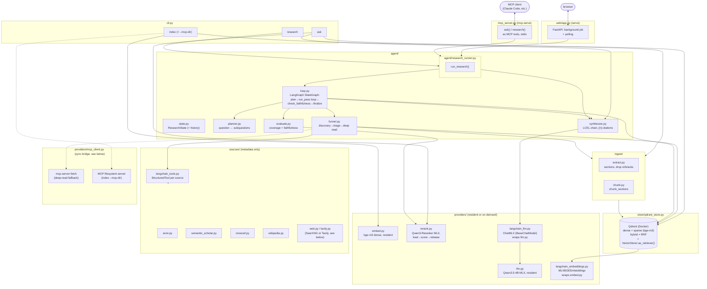

# local-research-agent

A local deep-research agent that runs entirely on-device (MacBook M4 Air,
16GB, MLX). It searches arXiv, Semantic Scholar, CrossRef, Wikipedia, and
the general web (Tavily or a local SearXNG instance), reads and cites what
it finds, and self-checks its own answers before returning them. It can
also reach further via MCP servers (page fetching, arbitrary local
directories), and it exposes itself as an MCP server so other MCP clients
can call it as a tool.

The standing engineering rules (memory constraints, provider-seam
convention, test policy) live in [CLAUDE.md](CLAUDE.md). This file
describes the system as it stands today.

## Quickstart

```bash
uv venv
uv pip install -r requirements.txt

docker compose up -d qdrant   # Qdrant vector store — required, see below
python -m src.cli index
python -m src.cli ask "What is RAG?"

cp .env.example .env   # optional: add TAVILY_API_KEY for broader web search
docker compose up -d   # optional: local SearXNG fallback if no Tavily key
python -m src.cli research "What approaches exist for KV-cache compression in transformers?"

python -m src.cli serve   # web UI at http://127.0.0.1:8000

python -m src.cli mcp-serve   # MCP server (stdio): exposes ask/research as tools

uv run pytest -q
```

## Architecture



Key memory invariant: `embed`/`llm` stay resident; `rerank` loads and
releases on every call — two heavy models are never resident at once next
to the reranker. `langchain_llm.py`/`langchain_embeddings.py` are thin
LangChain-interface wrappers over the same resident `llm.py`/`embed.py`
instances, not separate model copies.

## Local RAG: `index` / `ask`

The simple path: build an embedding index from local files, then ask
questions grounded in that index only (no internet access).

- `ingest/extract.py` — section-aware extraction (markdown/HTML/PDF), drops
  References/Bibliography/Acknowledgments/Appendix sections.
- `ingest/chunk.py` — `chunk_sections` chunks along section boundaries so a
  chunk never straddles two sections.
- `store/qdrant_store.py` — hybrid search (`search_hybrid`): dense vector +
  sparse vector (bge-m3's own lexical weights, same forward pass as dense —
  see `providers/embed.py`), merged via Qdrant's Query API RRF fusion.
  `search_dense` is kept as a baseline for comparison. Runs against a real
  Qdrant server (Docker, `docker compose up -d qdrant`) — a deliberate
  choice over Qdrant's embedded/serverless mode, see `QdrantStore`'s
  docstring. `QdrantStore` also implements
  `langchain_core.vectorstores.VectorStore` (`similarity_search`/
  `add_texts`/`.as_retriever()`) as an additive layer on top of the same
  hybrid search — `agent/research_runner.retrieve()` (the shared retrieval
  step for both `ask` and `research`) goes through `.as_retriever()`.
- `providers/rerank.py` — `mlx-community/Qwen3-Reranker-0.6B-4bit` (pure
  MLX, 331MB). `ask` takes `RERANK_CANDIDATES_K` hybrid-search hits, the
  reranker loads, scores, releases, and returns the top
  `TOP_K_RETRIEVE`. Toggle off with `config.RERANK_ENABLED = False`.
- `agent/synthesize.py` — an LCEL chain (`prompt | ChatMLX() |
  StrOutputParser()`) over the same resident LLM, not a second model
  instance.

```bash
python -m src.cli index
python -m src.cli ask "What is RAG?"
```

`index` reads `.txt`/`.md`/`.html`/`.pdf` files from `corpus/` (the repo
ships a small sample corpus: three notes on RAG/vector DBs/local LLMs, plus
one sample "paper" with Abstract/Introduction/Method/Results/Conclusion/
References/Acknowledgments to exercise the reference-stripping logic).

## Deep research: `research`

```bash
python -m src.cli research "What approaches exist for KV-cache compression in transformers?"
```

Unlike `ask`, `research` actively goes out and finds new material instead
of only searching a pre-built index:

- `agent/state.py` — `ResearchState`: subquestions, candidates, `read_ids`,
  findings, budget.
- `sources/arxiv.py`, `sources/semantic_scholar.py`, `sources/crossref.py`,
  `sources/wikipedia.py`, `sources/web.py` / `sources/tavily.py` —
  metadata-only discovery, all keyless except the web source. arXiv/
  Semantic Scholar cover preprints, CrossRef adds published/journal work
  (real citation counts via `is-referenced-by-count`), Wikipedia covers
  general/background subquestions the others don't. The web source picks
  Tavily if `TAVILY_API_KEY` is set, otherwise falls back to a local
  SearXNG instance (see below). `ArxivSource(categories=...)` — used by
  `default_sources()` with `config.ARXIV_AI_CATEGORIES` (cs.AI/cs.LG/cs.CL/
  cs.CV/cs.NE/stat.ML) — AND's a `cat:` filter into the keyword query so
  ambiguous ML terms ("attention", "transformer") don't pull in physics/
  neuroscience/econ papers that happen to use the same words.
- `agent/planner.py` — question → subquestions via a deterministic
  heuristic, not an LLM call (small local models are unreliable
  multi-step planners, so planning logic lives in code).
- `agent/funnel.py` — discovery → embedding-based triage → deep read: PDF
  fetch + section extraction for arXiv; for other sources, full page text
  via an MCP fetch server if enabled (`config.MCP_FETCH_ENABLED`, off by
  default — see "MCP: tools this agent uses" below), else the abstract as a
  fallback. Non-English subquestions get translated to a short English
  search query via a bounded LLM call first — arXiv/Semantic Scholar
  otherwise return zero results for Russian queries. Each source is
  invoked through a LangChain `StructuredTool`
  (`sources/langchain_tools.py`), not `Source.discover()` directly — the
  discovery/parsing logic itself is unchanged, only the call boundary is a
  standard LangChain tool interface.
- `agent/loop.py` — the iterative controller, implemented as a LangGraph
  `StateGraph` (`plan` → `run_pass` loop → `check_faithfulness` →
  `finalize`). A subquestion is "covered" when retrieval clears a reranker
  score threshold (`FUNNEL_MIN_RERANK_SCORE = 0.5`) across at least
  `FUNNEL_MIN_SOURCES_TO_COVER = 3` distinct sources; each retry pass asks
  sources for more candidates than the last.

Search breadth and budget are tunable in `config.py`:
`FUNNEL_DISCOVERY_LIMIT_PER_SOURCE` (candidates requested per source),
`FUNNEL_TRIAGE_TOP_N` (how many go to deep read), and
`DEFAULT_BUDGET_MAX_ITERATIONS` / `_MAX_DEEP_READS` / `_MAX_SECONDS`.

### Citation-aware triage

- Semantic Scholar reports `citationCount` directly; arXiv doesn't, so it's
  backfilled via the [OpenAlex](https://openalex.org) Works API
  (`sources/citations.py`, no key required). The triage score is semantic
  similarity to the subquestion plus a small log-scaled citation boost
  (`config.CITATION_BOOST_SCALE`) — a tie-breaker between similarly
  relevant candidates, not a substitute for relevance.
- **Recency boost** (`agent/funnel.py::_recency_boost`,
  `config.RECENCY_BOOST_SCALE`/`RECENCY_HALF_LIFE_DAYS`) — an independent,
  exponentially-decaying boost from `published_date` (currently only arXiv
  populates it). Citation boost alone structurally buries brand-new papers
  — they can't have accumulated citations yet — which fights the goal of
  actually surfacing what's new; the two boosts are summed, not traded off
  against each other, so a fresh uncited paper and an old well-cited one
  each get scored on their own axis.
- `url` and `citation_count` flow through the whole pipeline (discovery →
  deep read → Qdrant → retrieval) and show up as clickable links (CLI:
  a plain URL most terminals auto-link; web UI: a real `<a href>` with a
  citation-count badge when known).

### Self-evaluation

`agent/evaluate.py` checks the generated answer before it ships:

- **Citation coverage** — share of claim-sentences carrying at least one
  `[n]`.
- **Faithfulness** — share of cited claims actually supported by the text
  of their cited source, checked via `providers/rerank.score_pairs`
  (reuses the existing reranker instead of a separate NLI model or another
  LLM call).

`agent/loop.py` wires this in: once every subquestion is covered, a draft
answer is scored, and if faithfulness is low, subquestions reopen for one
more forced-discovery pass within budget — `force_discovery` guarantees a
real new search happens on that pass even if the persistent index would
otherwise consider the subquestion already "covered" by stale content from
an earlier question.

### Process visibility

The answer isn't a black box — after completion, the page/CLI output keeps:

- **Progress log** — stays visible next to the answer (not hidden once
  done): how many subquestions, how many iterations, what got read.
- **All discovered candidates** — a table of every candidate the funnel
  found (not just the ones cited in the final answer), sorted by triage
  score: score, citation count, source (`arxiv`/`semantic_scholar`/`web`),
  a clickable link, and a checkmark if it was actually deep-read
  (`agent/research_runner.py::CandidateSummary`).

### Follow-up questions and "tell me more"

`research` isn't a single question-answer round-trip — after the first
answer, the conversation keeps going and reuses the same `ResearchState`
(`agent/research_runner.run_followup`) instead of starting over:

- **CLI** — drops into an interactive prompt after the first answer. Type
  a follow-up question directly, or `подробнее N` / `more N` to force a
  deep-read of the Nth candidate from the printed list and get a focused
  answer about it. Empty line or Ctrl-D exits.
- **Web UI** — a "Уточнить" box appears under each answer for free-text
  follow-ups, and every row in the candidates table has a "подробнее"
  button that does the same forced deep-read. Every turn appends its own
  panel instead of overwriting the previous one, so the whole exchange
  stays visible.
- Already-read candidates, embeddings, and Qdrant rows from earlier turns
  are reused as-is (a real cache hit, not a rebuild) — only the new
  follow-up's own subquestions get budget and can trigger new discovery;
  `synthesize()` is given the prior Q&A pairs as history so "what about
  X"-style questions resolve correctly.

## MCP: tools this agent uses, and using this agent as a tool

This agent is both an **MCP client** (it can call out to other MCP servers
for extra capabilities) and an **MCP server** (other MCP clients — Claude
Code, Claude Desktop, etc. — can call it).

`providers/mcp_client.py` is the shared piece: a sync bridge over
`langchain-mcp-adapters` (async-only) — the rest of the codebase is
synchronous throughout, so this is the one place that spins an event loop.
`get_mcp_tools(connections)` connects to an MCP server just long enough to
list its tools, then returns them re-wrapped so `.invoke()` works from
plain sync code; each actual call opens its own short-lived session (the
library's model, not a persistent connection — fine at this project's
scale, a single local user).

### MCP servers this agent calls out to (client side)

- **Deep-read fallback via MCP fetch** (`funnel.py`, `config.MCP_FETCH_ENABLED`,
  **off by default**) — for non-arXiv candidates, fetches the full page
  text through [`mcp-server-fetch`](https://github.com/modelcontextprotocol/servers/tree/main/src/fetch)
  (spawned on demand via `uvx`) instead of settling for the short abstract.
  Off by default because it's an extra external dependency (`uvx` +
  network egress per candidate) beyond this project's own HTTP clients —
  enable it once `uvx` is available:
  ```bash
  uvx --from mcp-server-fetch --with "mcp<2" mcp-server-fetch --help   # sanity check
  ```
  then set `config.MCP_FETCH_ENABLED = True`. (Pinned to `mcp<2`: the
  `mcp-server-fetch` release at the time of writing imports a name that
  was renamed in `mcp` 2.0, confirmed by a real crash on this machine.)
- **`index --mcp-dir <path>`** — pulls `.txt`/`.md`/`.html`/`.htm` files
  from any directory on disk through the
  [MCP filesystem server](https://github.com/modelcontextprotocol/servers/tree/main/src/filesystem)
  (`npx`, no install step), in addition to `corpus/`. Repeatable:
  ```bash
  python -m src.cli index --mcp-dir ~/Documents/research-notes --mcp-dir ~/Downloads/papers
  ```
  PDFs aren't supported through this path yet — `extract_pdf_sections`
  needs a real filesystem path, and PDFs under an indexed directory can
  just be read directly instead of round-tripping through MCP.
- **GitHub as a source** (`sources/github_mcp.py`, `config.GITHUB_MCP_ENABLED`,
  **off by default**) — repository search via the official
  [GitHub MCP server](https://github.com/github/github-mcp-server) (Docker),
  for subquestions about a specific library/tool that papers/encyclopedic
  sources don't cover. `stargazers_count` feeds the same citation-boost
  triage as papers. Needs `GITHUB_PERSONAL_ACCESS_TOKEN` in `.env`
  (read-only scopes are enough); without it `discover()` no-ops without
  touching Docker. Off by default for the same reason as MCP fetch — a
  Docker container spin-up per call is real per-question latency to pay
  unconditionally. Note: its repo search matches best against short
  keyword queries, not full natural-language questions (found on a real
  run — see the module docstring).

### Using this agent as an MCP server

`python -m src.cli mcp-serve` runs `mcp_server.py` over stdio, exposing two
tools — `ask` (local RAG over `corpus/`, no internet) and `research` (the
full deep-research pipeline, can take a couple of minutes). Both reuse the
exact `agent/research_runner.py` functions the CLI and web UI already call
— no separate reimplementation.

To register it with **Claude Code** (project- or user-level `.mcp.json`):

```json
{
  "mcpServers": {
    "local-research-agent": {
      "command": "/absolute/path/to/local-research-agent/.venv/bin/python",
      "args": ["-m", "src.cli", "mcp-serve"],
      "cwd": "/absolute/path/to/local-research-agent"
    }
  }
}
```

For **Claude Desktop**, add the same `local-research-agent` entry under
`mcpServers` in its config file (`~/Library/Application Support/Claude/claude_desktop_config.json`
on macOS), then restart the app. Either way, use the venv's own Python
(not a bare `python`/`python3`) so the MCP process sees this project's
installed dependencies without needing an active shell activation.

## Web search: Tavily (recommended) or local SearXNG

`agent/research_runner.py::default_sources()` picks the web source
automatically:

- **`TAVILY_API_KEY` set** (in `.env`, see `.env.example`) → `sources/tavily.py`,
  a managed search API with no third-party engine reliability problems.
  Gives noticeably broader, more authoritative coverage in practice.
- **No key** → `sources/web.py`, a local [SearXNG](https://docs.searxng.org/)
  instance in Docker — no key, no rate limits of its own, but some of its
  underlying engines (DuckDuckGo, Brave) get blocked by their own
  providers (CAPTCHA/rate-limit) even through a local proxy.

```bash
cp .env.example .env
# put TAVILY_API_KEY=... in .env — free tier is roughly 1000 requests/month
```

Without a Tavily key, use local SearXNG instead:

```bash
docker compose up -d searxng  # start (once, runs in the background) — qdrant is a separate service, see Quickstart
docker compose down           # stop everything (qdrant + searxng)
curl "http://localhost:8888/search?q=test&format=json"   # sanity check
```

Without `docker compose up -d` running, `WebSource.discover()` just
returns an empty list — `research` doesn't crash, the funnel carries on
with whatever arXiv/Semantic Scholar found.

## Web UI: `serve`

```bash
python -m src.cli serve                    # http://127.0.0.1:8000
python -m src.cli serve --port 8080         # different port
```

FastAPI plus a single plain-JS HTML page (no build step, no Node/npm). A
`research()` run can take minutes (real models, external APIs), so it runs
in a background thread; the client polls `GET /api/jobs/{id}` once a
second rather than using SSE/WebSockets — unnecessary complexity for a
single local user. Only one job runs at a time (loading multiple heavy
models concurrently isn't safe on 16GB) — a second request while one is
running gets `409`, not a silent queue.

## Tracing: LangSmith

Off by default (`config.LANGSMITH_TRACING_ENABLED = False`) — not a
latency/dependency concern like the MCP flags above, but "don't ship
question text + retrieved chunks + synthesized answers to a third-party
cloud service without an explicit opt-in".

To enable: get a key at [smith.langchain.com](https://smith.langchain.com),
add `LANGSMITH_API_KEY=...` to `.env`, and set
`config.LANGSMITH_TRACING_ENABLED = True`. `providers/tracing.py` then sets
the env vars LangChain/LangSmith read (`LANGSMITH_TRACING`,
`LANGSMITH_PROJECT`) once at process start (`cli.py`, `web/app.py`,
`mcp_server.py`) — nothing else in the codebase talks to LangSmith
directly.

Because this project already routes almost everything through
LangChain/LangGraph (see the Stack section in `CLAUDE.md`: `ChatMLX`, the
LCEL synthesis chain, `QdrantStore` as a `VectorStore`, each `Source`
wrapped as a `StructuredTool`, MCP tools, and the `agent/loop.py` research
graph itself), turning tracing on instruments the whole pipeline at once —
no per-component wiring needed. In the LangSmith UI, one `research()` call
shows up as a single trace tree: the LangGraph nodes (`plan` → `run_pass` →
`check_faithfulness` → `finalize`), every source's discovery tool call
nested under `run_pass`, the retrieval calls, and the final synthesis LLM
call, each with inputs/outputs/latency.

## Tests and eval scripts

```bash
uv run pytest -q
```

Unit tests are offline and fast — embeddings and the LLM are mocked, no
real model load needed to run the suite.

All eval scripts share one golden set (`scripts/eval_data.py`, 18 cases —
question + expected `corpus/` doc + hand-written reference answer) instead
of duplicating question text per script. `corpus/` has 9 docs (4 original +
5 added for eval coverage: chunking, reranking, citation faithfulness,
embedding models, query rewriting — the last two deliberately overlap in
topic with existing docs, e.g. embeddings vs. vector databases vs.
rerankers, so retrieval has real disambiguation to do instead of one
obviously-correct document per question).

A few scripts run against real models (not part of `pytest`, since
measuring retrieval/rerank/faithfulness quality without real models would
be meaningless):

```bash
python -m src.cli index
python -m scripts.eval_retrieval      # dense vs hybrid recall@k + MRR
python -m scripts.eval_rerank         # hybrid vs hybrid+rerank hit@1
python -m scripts.eval_faithfulness   # citation coverage + faithfulness
python -m scripts.eval_correctness    # LLM-judge correctness (needs LANGSMITH_API_KEY, uploads to LangSmith)
python -m scripts.eval_ragas          # RAGAS context precision/recall (judge: resident ChatMLX, needs LANGSMITH_API_KEY, no external LLM API)
```

`eval_correctness.py` and `eval_ragas.py` upload to the same LangSmith
dataset (`config.LANGSMITH_EVAL_DATASET`) as two separate experiments —
compare them side by side in the LangSmith UI rather than reading two
separate console tables.

## Known assumptions (`ARCH-Q`)

Assumptions that couldn't be verified without real hardware are marked
`# ARCH-Q:` directly in the code (`src/config.py`, `src/providers/embed.py`,
`src/providers/llm.py`) — LLM HF repo/tag, the FlagEmbedding device kwarg,
`enable_thinking` support in the chat template, and so on. Each has since
been exercised on the target hardware (real model loads, real external
calls) as part of normal development — the `# ARCH-Q:` comments are kept
as a log of what was originally uncertain, not as open questions.
